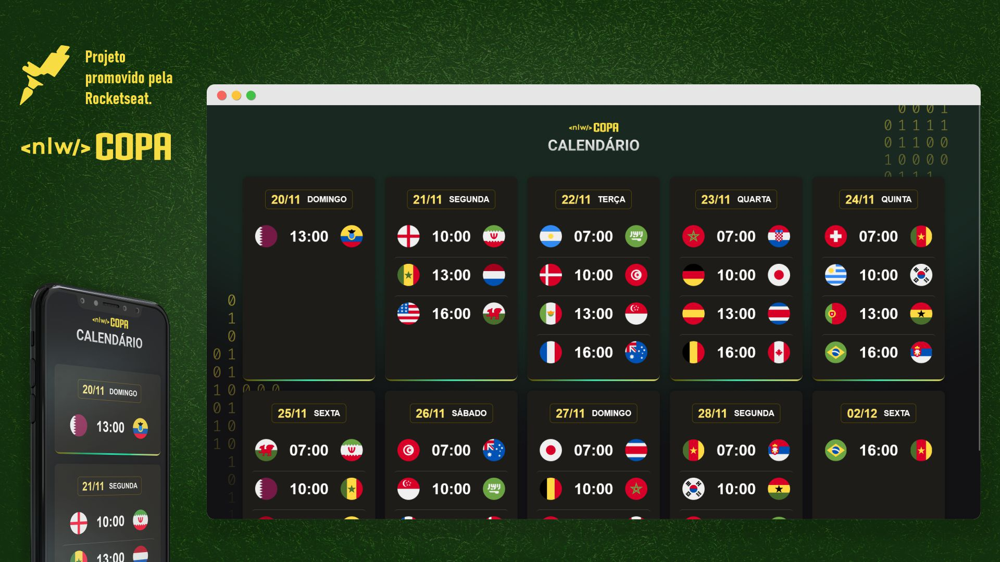

<h1 align="center">NLW Copa #10 - Calendário de Jogos</h1>

Evento exclusivo e gratuito, promovido pela Rocketseat para ensino de tecnologias WEB.

  <a href="#computer-tecnologias">Tecnologias</a>&nbsp;&nbsp;&nbsp;|&nbsp;&nbsp;&nbsp;
  <a href="#books-projeto">Projeto</a>&nbsp;&nbsp;&nbsp;|&nbsp;&nbsp;&nbsp;
  <a href="#triangular_ruler-layout">Layout</a>&nbsp;&nbsp;&nbsp;|&nbsp;&nbsp;&nbsp;
  <a href="#tada-extensão">Extensão</a>&nbsp;&nbsp;&nbsp;|&nbsp;&nbsp;&nbsp;
  <a href="#memo-licença">Licença</a>

  

 

  

## :computer: Tecnologias

Esse projeto foi desenvolvido com as seguintes tecnologias:

- HTML
- CSS
- JavaScript
<!-- - [Node e NPM](https://nodejs.org/)
-->

## :books: Projeto

O Calendário de Jogos permite que você verifique e acompanhe os dias e horários dos jogos de todas as seleções participantes na Copa do Mundo do Qatar 2022.

## :triangular_ruler: Layout

Você pode visualizar o layout do projeto através desse [link](https://www.figma.com/file/gpqavL469k0pPUGOmAQEM9/Explorer-Lab-%2301/duplicate). Não esqueça de avaliar o projeto.

## :tada: Extensão

- 
 Incorporar o "Calendários de Jogos" com o App Web desenvolvido na NLW Trilha Ignite.

- 
 Desenvolver, de forma mais ampla, o projeto do NLW Trilha Ignite.

## :memo: Licença

Esse projeto está sob a licença MIT.

Ensinado com :blue_heart: pela Rocketseat e acompanhado com +:blue_heart: por Jônatas Rodrigues. [Participe da comunidade Rocketseat!](https://discord.gg/rocketseat)

